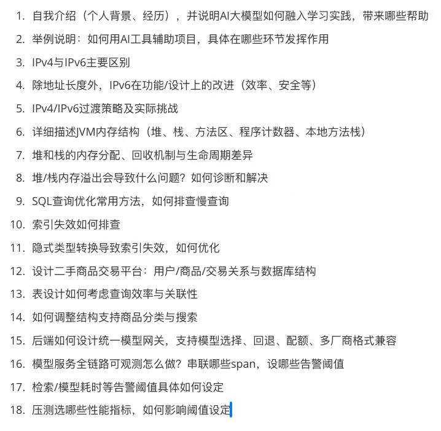

#



---

## 面试问题与答案

### 1. 自我介绍（个人背景、经历），并说明AI大模型如何融入学习实践，带来哪些帮助

**参考回答：**

我目前是一名在校学生/应届毕业生，主要学习方向是Java后端开发。在学习过程中，我会使用AI大模型（如ChatGPT、Claude等）辅助学习。

AI大模型带来的帮助主要有：

- **知识理解**：遇到复杂概念时，让AI用更通俗的方式解释，或举具体例子说明
- **代码debug**：粘贴报错信息，AI能快速定位问题并给出修复思路
- **代码Review**：让AI审查我写的代码，找出潜在问题并给出优化建议
- **学习路径规划**：询问某个技术方向的学习路线，获取系统化建议
- **面试准备**：模拟面试问答，练习表达和查漏补缺

---

### 2. 举例说明：如何用AI工具辅助项目，具体在哪些环节发挥作用

**参考回答：**

以开发一个电商后端项目为例：

- **需求分析阶段**：让AI帮助分析需求，梳理实体关系，生成初步的数据库表设计建议
- **编码阶段**：遇到不熟悉的API（如Redis命令、MQ用法），直接问AI获取示例代码，再理解后集成
- **联调阶段**：接口联调时出现数据不一致，将代码片段和异常日志贴给AI，快速定位是序列化问题还是字段映射问题
- **性能优化阶段**：将慢查询SQL贴给AI，让它分析执行计划并给出加索引或改写SQL的建议
- **文档编写阶段**：让AI根据代码自动生成接口文档草稿，再人工核对补充

---

### 3. IPv4与IPv6主要区别

**参考回答：**

| 对比维度 | IPv4                      | IPv6                            |
| -------- | ------------------------- | ------------------------------- |
| 地址长度 | 32位，约43亿个地址        | 128位，约3.4×10³⁸个地址         |
| 表示方式 | 点分十进制（192.168.1.1） | 冒号分隔十六进制（2001:db8::1） |
| 头部长度 | 可变（20-60字节）         | 固定40字节                      |
| NAT需求  | 因地址不足，大量使用NAT   | 地址充足，无需NAT               |
| 安全性   | IPSec可选                 | IPSec内置支持                   |
| 广播     | 支持广播                  | 取消广播，改用多播/任播         |
| 配置方式 | 手动或DHCP                | 支持无状态自动配置（SLAAC）     |
| 校验和   | 头部有校验和字段          | 取消头部校验和（由传输层负责）  |

---

### 4. 除地址长度外，IPv6在功能/设计上的改进（效率、安全等）

**参考回答：**

- **简化头部结构**：IPv6头部固定40字节，去除了IPv4中的可选字段和校验和，路由器处理效率更高
- **扩展头部机制**：通过扩展头部（Extension Headers）按需添加选项，不影响基本转发性能
- **内置IPSec**：IPv6将IPSec（认证和加密）作为必须支持的协议，安全性更好
- **无状态地址自动配置（SLAAC）**：设备可以根据接口MAC地址自动生成全球唯一地址，无需DHCP服务器
- **取消广播，引入任播（Anycast）**：减少广播风暴，任播可将请求路由到最近的节点
- **流标签（Flow Label）**：支持QoS，路由器可以对同一数据流的数据包进行特殊处理
- **分片处理改变**：IPv6中只有源端才能分片，路由器不再处理分片，减少中间节点负担

---

### 5. IPv4/IPv6过渡策略及实际挑战

**参考回答：**

**主要过渡策略：**

1. **双栈（Dual Stack）**：设备同时运行IPv4和IPv6协议栈，与两种网络都能通信。实现简单，但需要维护两套地址
2. **隧道技术（Tunneling）**：将IPv6数据包封装在IPv4数据包中传输，穿越纯IPv4网络。常见方案有6to4、Teredo、ISATAP
3. **NAT64/DNS64**：纯IPv6客户端访问IPv4服务器时，通过网关做协议转换，DNS64将A记录合成AAAA记录

**实际挑战：**

- **兼容性问题**：大量遗留应用和设备只支持IPv4，改造成本高
- **双栈运维复杂**：需要同时维护两套地址规划、路由策略和安全策略
- **性能开销**：隧道封装和NAT64转换增加延迟和计算开销
- **过渡期漫长**：互联网基础设施改造需要全球协调，无法一蹴而就
- **安全新挑战**：隧道流量较难检测，可能被用于绕过防火墙

---

### 6. 详细描述JVM内存结构（堆、栈、方法区、程序计数器、本地方法栈）

**参考回答：**

JVM运行时数据区分为以下几个区域：

**线程共享区域：**

- **堆（Heap）**：JVM内存最大的区域，存放对象实例和数组。是GC的主要工作区域，分为年轻代（Eden + Survivor×2）和老年代
- **方法区（Method Area）**：存储类的元信息（类名、访问修饰符、字段、方法描述、静态变量、常量池等）。JDK8之前称为永久代（PermGen），JDK8后改为元空间（Metaspace），使用本地内存

**线程私有区域：**

- **虚拟机栈（VM Stack）**：每个方法调用时创建一个栈帧，存放局部变量表、操作数栈、动态链接、方法返回地址。方法调用结束，栈帧出栈
- **本地方法栈（Native Method Stack）**：为Native方法服务，与虚拟机栈类似，HotSpot中两者合并实现
- **程序计数器（Program Counter Register）**：记录当前线程正在执行的字节码指令地址。是唯一不会OOM的区域，线程切换后用于恢复执行位置

---

### 7. 堆和栈的内存分配、回收机制与生命周期差异

**参考回答：**

| 对比维度 | 堆                                      | 栈                                   |
| -------- | --------------------------------------- | ------------------------------------ |
| 存储内容 | 对象实例、数组                          | 局部变量、方法调用帧                 |
| 分配方式 | `new`关键字动态分配                     | 随方法调用自动分配                   |
| 回收方式 | GC垃圾回收（标记-清除/复制/整理等算法） | 方法结束自动弹栈，无需GC             |
| 生命周期 | 对象不再被引用后由GC回收，时间不确定    | 与方法调用同生命周期，方法返回即释放 |
| 线程共享 | 所有线程共享                            | 每个线程独有                         |
| 大小     | 较大，可通过-Xmx/-Xms配置               | 较小，可通过-Xss配置                 |
| 异常     | OutOfMemoryError                        | StackOverflowError                   |
| 速度     | 分配慢（需GC管理）                      | 分配快（指针移动）                   |

---

### 8. 堆/栈内存溢出会导致什么问题？如何诊断和解决

**参考回答：**

**堆内存溢出（OutOfMemoryError: Java heap space）：**

- **原因**：创建对象过多、内存泄漏（对象不再使用但仍被引用）、一次性加载数据量过大
- **诊断**：
  - 添加JVM参数 `-XX:+HeapDumpOnOutOfMemoryError` 生成堆快照
  - 使用MAT（Memory Analyzer Tool）或VisualVM分析堆快照，找出占用最多内存的对象及引用链
  - 查看GC日志，观察GC频率和回收效果
- **解决**：修复内存泄漏（检查集合、缓存、监听器等）、增大堆内存（-Xmx）、优化数据加载方式（分页、流式处理）

**栈内存溢出（StackOverflowError）：**

- **原因**：方法递归层数过深（无终止条件或终止条件错误）
- **诊断**：查看异常堆栈，找到重复出现的调用链
- **解决**：检查递归终止条件、将递归改为迭代、适当增大栈深度（-Xss）

---

### 9. SQL查询优化常用方法，如何排查慢查询

**参考回答：**

**慢查询排查：**

1. 开启慢查询日志：`slow_query_log = ON`，设置阈值 `long_query_time`
2. 用 `EXPLAIN` 分析执行计划，重点关注 `type`（全表扫描ALL最差）、`key`（使用的索引）、`rows`（预估扫描行数）、`Extra`（是否Using filesort/Using temporary）
3. 使用 `SHOW PROFILE` 查看SQL各阶段耗时

**常用优化方法：**

- **索引优化**：为WHERE、JOIN ON、ORDER BY、GROUP BY字段添加合适索引；使用覆盖索引避免回表
- **避免索引失效**：不在索引列做函数运算、隐式类型转换；遵守最左前缀原则
- **SQL改写**：避免`SELECT *`；大IN列表改为JOIN；子查询改为JOIN；分页优化（延迟关联）
- **减少数据量**：分页查询、只查需要的列
- **表结构优化**：选择合适的数据类型，减少存储空间

---

### 10. 索引失效如何排查

**参考回答：**

**排查步骤：**

1. `EXPLAIN` 查看执行计划，若 `type=ALL` 且 `key=NULL`，说明索引未生效
2. 检查查询条件是否满足索引使用规则

**常见索引失效原因：**

- **违反最左前缀原则**：联合索引(a,b,c)，查询只用b或c，或跳过a
- **索引列做函数或运算**：`WHERE DATE(create_time) = '2024-01-01'`（应改为范围查询）
- **隐式类型转换**：字段是varchar，WHERE条件传入数字，MySQL自动转换导致索引失效
- **LIKE前缀模糊**：`LIKE '%xxx'` 失效，`LIKE 'xxx%'` 可以用索引
- **使用OR连接非索引列**：OR两侧有一侧无索引，整体走全表扫描
- **NOT IN / NOT EXISTS**：负向查询通常不走索引
- **数据量少**：优化器认为全表扫描比索引更快，主动放弃索引

---

### 11. 隐式类型转换导致索引失效，如何优化

**参考回答：**

**场景举例：**

```sql
-- 字段 phone 类型为 VARCHAR(11)，但传入数字
SELECT * FROM user WHERE phone = 13800138000;
-- MySQL会将phone列每一行都转为数字比较，导致索引失效
```

**根本原因：** MySQL在比较时，若类型不一致，会将索引列的值进行转换（字符串转数字），转换后的值无法直接走B+树索引

**优化方法：**

1. **传参类型与字段类型保持一致**（最根本的解决方案）：

   ```sql
   SELECT * FROM user WHERE phone = '13800138000';
   ```

2. **代码层面做类型校验**：在Java代码中确保传参类型正确，使用MyBatis时注意`#{}` 传参类型
3. **表结构评审**：定期检查字段类型设计是否合理，避免用字符串存数字
4. **使用 `EXPLAIN` 日常巡查**：对核心查询定期检查执行计划

---

### 12. 设计二手商品交易平台：用户/商品/交易关系与数据库结构

**参考回答：**

**核心实体关系：**

- 用户（User）可以发布多个商品（作为卖家）
- 用户可以购买多个商品（作为买家）
- 商品属于某一分类（Category）
- 交易（Order）关联买家、卖家、商品

**核心表设计：**

```sql
-- 用户表
CREATE TABLE `user` (
  `id`       BIGINT PRIMARY KEY AUTO_INCREMENT,
  `username` VARCHAR(50) NOT NULL UNIQUE,
  `phone`    VARCHAR(11) NOT NULL UNIQUE,
  `avatar`   VARCHAR(255),
  `rating`   DECIMAL(3,2) DEFAULT 5.00,  -- 信用评分
  `created_at` DATETIME NOT NULL
);

-- 商品分类表
CREATE TABLE `category` (
  `id`        INT PRIMARY KEY AUTO_INCREMENT,
  `name`      VARCHAR(50) NOT NULL,
  `parent_id` INT DEFAULT 0  -- 支持多级分类
);

-- 商品表
CREATE TABLE `item` (
  `id`          BIGINT PRIMARY KEY AUTO_INCREMENT,
  `seller_id`   BIGINT NOT NULL,  -- 卖家ID
  `category_id` INT NOT NULL,
  `title`       VARCHAR(100) NOT NULL,
  `description` TEXT,
  `price`       DECIMAL(10,2) NOT NULL,
  `status`      TINYINT DEFAULT 1,  -- 1:在售 2:已售 3:下架
  `created_at`  DATETIME NOT NULL,
  INDEX idx_seller(seller_id),
  INDEX idx_category(category_id),
  INDEX idx_status_price(status, price)
);

-- 交易订单表
CREATE TABLE `order` (
  `id`         BIGINT PRIMARY KEY AUTO_INCREMENT,
  `item_id`    BIGINT NOT NULL,
  `buyer_id`   BIGINT NOT NULL,
  `seller_id`  BIGINT NOT NULL,
  `price`      DECIMAL(10,2) NOT NULL,  -- 成交价（快照）
  `status`     TINYINT DEFAULT 1,  -- 1:待付款 2:已付款 3:已完成 4:已取消
  `created_at` DATETIME NOT NULL,
  INDEX idx_buyer(buyer_id),
  INDEX idx_seller(seller_id),
  INDEX idx_item(item_id)
);
```

---

### 13. 表设计如何考虑查询效率与关联性

**参考回答：**

- **冗余关键字段，减少JOIN**：订单表冗余 `seller_id`、`price`（成交价快照），避免每次查订单都关联商品表
- **选合适的数据类型**：主键用BIGINT而非UUID（B+树有序性更好）；金额用DECIMAL避免浮点精度问题；状态用TINYINT
- **索引设计**：根据最高频的查询场景设计联合索引（如"查某用户的在售商品按价格排序" → `(seller_id, status, price)`）
- **避免宽表**：将不常用的大字段（商品详细描述、图片列表）拆分到扩展表，主表保持精简
- **软删除**：商品下架用status字段标记，不物理删除，保留历史记录和订单关联
- **时间字段**：核心时间用DATETIME，对时区不敏感；需要时间戳运算场景可用BIGINT存毫秒值
- **外键约束**：生产环境通常不设DB外键（影响性能、扩展性），由应用层保证数据一致性

---

### 14. 如何调整结构支持商品分类与搜索

**参考回答：**

**分类支持：**

- 分类表使用 `parent_id` 支持多级分类（如：数码 → 手机 → 苹果）
- 查询某分类下所有商品时，通过递归或预存路径（`category_path`如`/1/5/12/`）快速定位所有子分类
- 商品表的 `category_id` 加索引，支持按分类筛选

**搜索支持：**

- **短期方案**：MySQL全文索引（`FULLTEXT INDEX`），适合数据量不大的场景
- **推荐方案**：引入 **Elasticsearch**，将商品标题、描述、分类等字段同步到ES
  - 支持中文分词（IK分析器）、模糊搜索、按价格/时间排序
  - MySQL作为主库保证数据一致性，ES作为搜索引擎，通过MQ或Canal同步数据
- **搜索字段设计**：标题权重 > 分类名 > 描述，可配置字段权重提升搜索精度

---

### 15. 后端如何设计统一模型网关，支持模型选择、回退、配额、多厂商格式兼容

**参考回答：**

**整体架构：**

```shell
客户端 → 统一模型网关 → 路由层 → 适配器层 → 各大模型厂商API
                         ↓
                     配额/限流/认证中间件
```

**核心设计要点：**

1. **统一接口协议**：网关对外暴露统一的请求/响应格式（参考OpenAI格式），屏蔽各厂商差异
2. **适配器模式**：每个厂商实现一个Adapter，负责协议转换（统一格式 ↔ 厂商格式）
3. **路由策略**：
   - 按场景路由（代码生成用A模型，通用问答用B模型）
   - 支持A/B测试，按比例分流
4. **回退机制（Fallback）**：主模型调用失败时，自动切换备用模型；可配置重试次数和超时时间
5. **配额管理**：
   - 按用户/业务线分配token配额
   - 使用Redis计数器实现滑动窗口限流
   - 超额后返回429或降级到低成本模型
6. **格式兼容**：通过适配器统一处理streaming（SSE）和非streaming响应
7. **鉴权**：统一管理各厂商API Key，客户端只需传内部token

---

### 16. 模型服务全链路可观测怎么做？串联哪些span，设哪些告警阈值

**参考回答：**

**全链路追踪（Tracing）- 串联的Span：**

```shell
[用户请求]
  └─ span: gateway-receive（接收请求，记录用户ID、模型选择）
      └─ span: auth-check（鉴权、配额检查）
          └─ span: model-route（路由决策）
              └─ span: adapter-transform（请求格式转换）
                  └─ span: llm-api-call（实际调用厂商API，记录首token延迟）
                      └─ span: response-transform（响应格式转换）
                          └─ span: token-count（token统计、配额扣减）
```

**关键指标（Metrics）：**

- 请求总量、成功率、错误率（按模型、业务线分维度）
- 端到端延迟（P50/P95/P99）
- 首token延迟（TTFT，Time To First Token）
- 生成速度（tokens/s）
- Token消耗量（输入/输出分别统计）

**告警阈值设置：**

| 指标              | 告警阈值           |
| ----------------- | ------------------ |
| 错误率            | >1% 预警，>5% 严重 |
| P99 延迟          | >10s 预警          |
| 首token延迟(TTFT) | >3s 预警           |
| 配额使用率        | >80% 预警          |
| 厂商API成功率     | <99% 预警          |

---

### 17. 检索/模型耗时等告警阈值具体如何设定

**参考回答：**

**设定方法：**

1. **基于历史基线**：先跑一段时间（1-2周）收集P50、P95、P99数据，以P99的1.5~2倍作为告警阈值
2. **业务SLA反推**：如业务要求95%请求在5s内响应，则P95阈值设为5s，告警在超过该值时触发
3. **分段设置告警级别**：
   - Warning：超过正常值的50%，发钉钉/邮件通知
   - Critical：超过正常值的100%，电话/短信告警 + 自动触发回退策略

**具体参考阈值：**

| 环节               | P99 Warning | P99 Critical |
| ------------------ | ----------- | ------------ |
| 向量检索（召回）   | >200ms      | >500ms       |
| Rerank重排序       | >300ms      | >800ms       |
| LLM首token（TTFT） | >2s         | >5s          |
| LLM完整响应        | >15s        | >30s         |
| 整体端到端         | >20s        | >45s         |

**注意事项：**

- 不同模型的阈值应分开设置（大模型天然比小模型慢）
- 节假日/大促期间可适当放宽阈值，避免误报
- 告警要有降噪机制（连续3次超阈值才告警，避免抖动误报）

---

### 18. 压测选哪些性能指标，如何影响阈值设定

**参考回答：**

**压测核心指标：**

| 指标                | 说明                                |
| ------------------- | ----------------------------------- |
| QPS/TPS             | 每秒请求量/事务量，衡量系统吞吐能力 |
| 响应时间（RT）      | P50/P95/P99延迟，关注长尾           |
| 错误率              | 超时、5xx的比例                     |
| 并发数              | 系统能稳定支持的最大并发连接数      |
| 资源利用率          | CPU、内存、网络IO、磁盘IO           |
| GC频率与时间        | Full GC频率高说明内存压力大         |
| 线程池/连接池使用率 | 接近100%说明是瓶颈                  |

**压测结果如何影响阈值设定：**

1. **找到系统极限**：压测找到QPS开始飙升错误率的拐点，将正常阈值设为该拐点的70%~80%（留安全余量）
2. **确定延迟基准**：压测在目标QPS下的P99延迟，以该值的1.5倍作为线上告警阈值
3. **资源利用率阈值**：压测中CPU超过70%开始影响延迟，则线上CPU告警设为70%
4. **制定扩容策略**：当QPS达到压测极限的60%时触发自动扩容，保证在达到极限前完成扩容

**压测注意点：**

- 压测环境应尽量贴近生产（数据量、网络拓扑）
- LLM接口压测要模拟真实的prompt长度分布
- 需要压测冷启动和预热后两种状态
