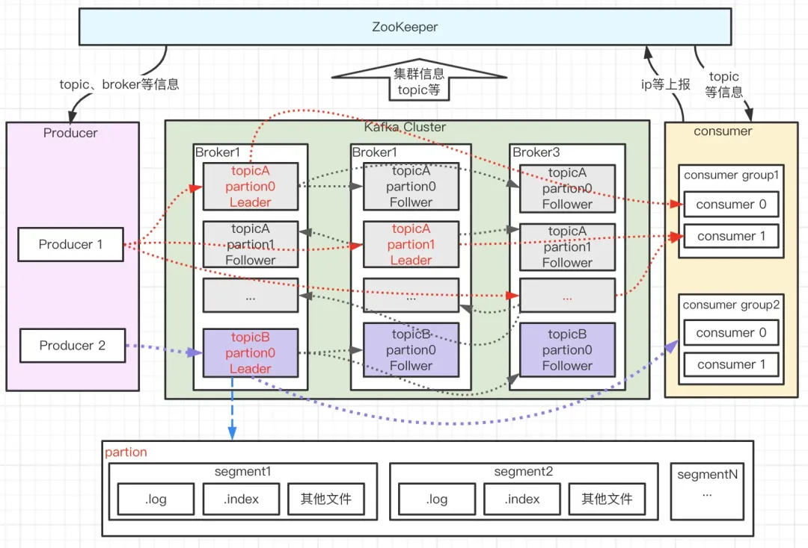

# Overview

这篇文章讲的挺不错的：<https://mp.weixin.qq.com/s/_g11mmmQse6KrkUE8x4abQ>

我发现看了黑马半天的视频，还不如腾讯这篇微信公众号上的推文写得好。有些基础概念需要纠正一下，原先的理解有些偏差。

## Route

1. Kafka 集群启动
2. 主题创建
3. 生产消息
4. 存储消息
5. 消费消息

后端：Kafka - SpringBoot

大数据：Kafka - Flume - Spark - Flink

## The definition of Kafka

先解释一下为什么要用Kafka

传统的收集海量数据的逻辑是：

1. 前端埋点手机记录用户购买商品的行为数据（浏览、点赞、评论等等）
2. 这些数据被发送到日志服务器：Log File 被发送到管道中（比如 Apache Flume，这玩意用来干嘛的呢，它实际上是一个**分布式、高可用**的系统，专门用来**高效收集、聚合和移动大量日志数据**）
3. 随后这些数据被发送到 **Hadoop** 上去（Hadoop 是一个开源的大数据框架，解决了**海量数据存储（HDFS）**和**海量数据计算（MapReduce/YARN）**这两个核心问题。

但是这样会遇到一个很麻烦的问题：比如说双十一这种活动，前端埋点获取到的数据量非常非常大，Flume 发送的数据可能大于 200m/s，而 Hadoop 它的上传速度可能只有 100m/s。那么问题就来了，怎么保证数据不丢呢？

所以**我们引入了Kafka**，作为比如说在 Flume 和 Hadoop 之间的中间件。

Kafka 的传统定义：Kafka 是一个分布式的，基于发布/订阅模式的消息队列（Message Queue）

发布/订阅模式：消息的发布者不会直接把消息发送给特定的订阅者，而是把**发布的消息**分为不同的类别，然后订阅者去订阅感兴趣的消息。

最新的定义：一个开源的**分布式事件流平台**（Event Streaming Platform）

## Kafka Overview

目前企业中常用的消息队列产品：Kafka、ActiveMQ、RabbitMQ、RocketMQ；

### 常见的应用场景

主要的目的是：**异步解耦**和**削峰填谷**

**缓冲/消峰**：这个场景很常见，比如双十一、秒杀等等。控制和优化数据经过系统的速度，主要是为了这个。
解**耦合**：这玩意允许独立的扩展或者修改两边的处理过程。Producer->MQ->Consumer
异步通信：允许用户把一个消息放到队列里去，但是并不着急处理它，等要弄的时候再说；

### 两种运用模式

1. 点对点模式：producer -> MessageQueue -> Consumer
2. 发布/订阅模式：
    - 可以有多个 topic 主题（浏览、点赞、收藏、转发等等）
    - Consumer 消费数据之后，不会删除数据
    - 每个消费者相互独立，都会消费到数据

### 基础架构

几个基础的概念：

- Producer：负责生产消息，并且通过一定的路由策略，把消息发送到合适的broker
- Broker：服务实例，负责消息的持久化和中转功能
- Consumer：消费者，负责从broker中拉取订阅的消息进行消费。几个消费者构成一个分组，消息只能被同组中的一个消费者消费
- Zookeeper：负责broker、Consumer集群的元数据的管理（**特别有一点需要注意：producer 直接连接broker，其不在zk上存储任何数据，只是通过zk去监听broker和topic的消息**）

还有几个特别重要的概念：

- 主题 topic: Kafka按照topic对消息进行分类，在收发消息的时候，指定topic
- 分区 partition: 一个topic对应多个partition，用于提升系统的吞吐。同时，多个partition分布在不同的broker上，用于存储topic的消息。为了提升系统的可靠性，partition也会进行分组。每个partition对应一个主节点Leader，多个副本Follower。分布在不同的broker上，起到容灾的作用。
- 分段 segment: 宏观上一个partition对应一个Log，为了防止log文件过大导致搜索效率低下，每个partition分成了多个segment。每个segment对应的文件名以该段中最小的offset作为文件名。当查找offset对应的Message时，通过**二分查找**，去找到Message所在的Segment中。
- 位置偏移量 offset: Message在日志Log中的位置，消息被分配到日志文件中时，会被指定一个特定的偏移量offset。注意到offset在分区中，是唯一的标识。Kafka通过offset来保证message在分区中的有序性，不过offset不会跨越partition。**也就是说，offset在partition内有序，在topic中不一定有序。**

### 基础细节

对于 producer -> TopicA -> Consumers

如果producer来的数据有100T，会导致TopicA的容量不够存储。对于这种海量数据，需要分而治之！

**Kafka为了方便扩展，并且提高吞吐量，一个topic分为多个partition。**（实际上是划分成为几个分区）

比如一个 Kafka cluster 分成了 TopicA- Partition0～2 三个部分

既然Kafka cluster被划分为了多个分区，那么消费者也对应的有分区的设计。这里提出了消费者组的概念，组内每个消费者并行消费，而且互不争抢。

为了提高可用性，partition中既有leader，也有follower。平时consumer消费的是leader，不消费follower。不过如果leader挂掉了，follower会通过一定的机制转换为新的leader。

在Kafka 2.8.0 之前，Kafka依赖zookeeper去记录谁是leader，而2.8.0版本之后，Kafka的配置逐步脱离zookeeper。
