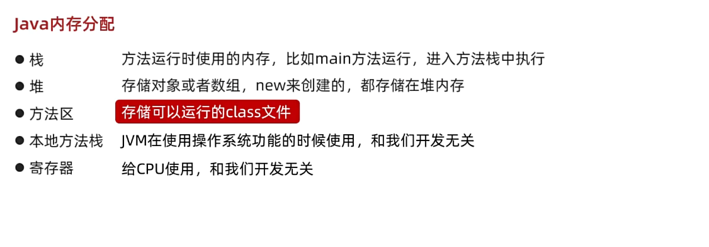

# Basic Info

## JRE & JDK

$JDK$：$Java$开发工具包，包含$JVM$，核心类库，开发工具。
$JRE$：$Java$的运行环境。包含：$JVM$，核心类库，运行工具。

### JDK，JRE，JVM包含关系

JDK包含JRE，JRE包含JVM

## Java基础语法

字面量：整数、小数类型之类的

制表符\t

变量：

这部分内容和C++几乎一模一样。

注意数据类型中的$boolean$

标识符：这玩意就是变量的名字

**键盘录入**：

$Scanner$类，读取到键盘输入的数据。
导包，创建对象，接受数据。

```java
import java.util.Scanner;

Scanner sc = new Scnaner(System.in);

int i = sc.nextInt();
```

关于IDEA，这个已经装了。

IEDA项目结构
Project->module(模块)->package(包)->class

运算符

这部分内容也和c++几乎差不多
数据类型最终往最大的那个类型转换。

原码、补码

原码：最左边是符号位，0正1负

原码的弊端在于负数计算就会出错

反码：正数的反码不变，负数的反码在原码的基础上，**符号位不变**，数值位取反。

补码：正数的补码不变，负数的补码在反码的基础上+1

注意到：计算机中的存储和计算都是以**补码**形式进行。

### $Java$的内存分配

包含栈、堆、方法区、本地方法栈、寄存器。


关于栈内存和堆内存：
$new$出来的东西在堆上

如果$new$了多次，在堆里面有多个小空间。

这部分和$c++$差不多

### 方法

方法是程序中**最小**的执行单元

便于调用方法，提高代码复用性，提高可维护性。

#### 方法的格式

这个“方法”有点像那个“函数”
形参：方法定义中的参数
实参：方法调用中的参数

#### 重载

同名方法，参数类型或个数不同

$Java$虚拟机会通过不同的参数来区分同名的方法

注意所谓的重载是针对**同一个类**中而言的

#### 方法调用的基本内存原理

对于栈内存而言，方法先进后出。

关于**基本数据类型**和**引用数据类型**

基本数据类型：在栈内存上……
引用数据类型：只要是$new$出来的，就是该类型。在堆内存上分配。

注意到，引用数据类型变量中存储的是地址值，所谓的引用，也就是使用了其他空间中的数据。

#### 方法的值传递

这个和c++差不多，传递引用数据类型时，会改变实际的值。
