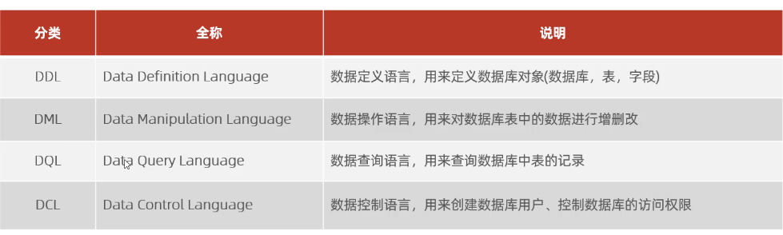
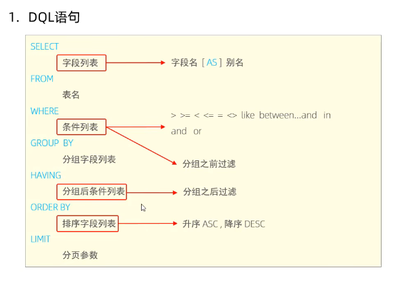
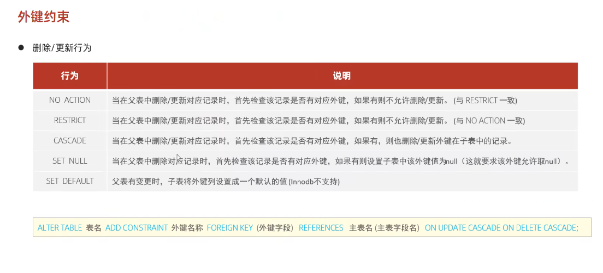
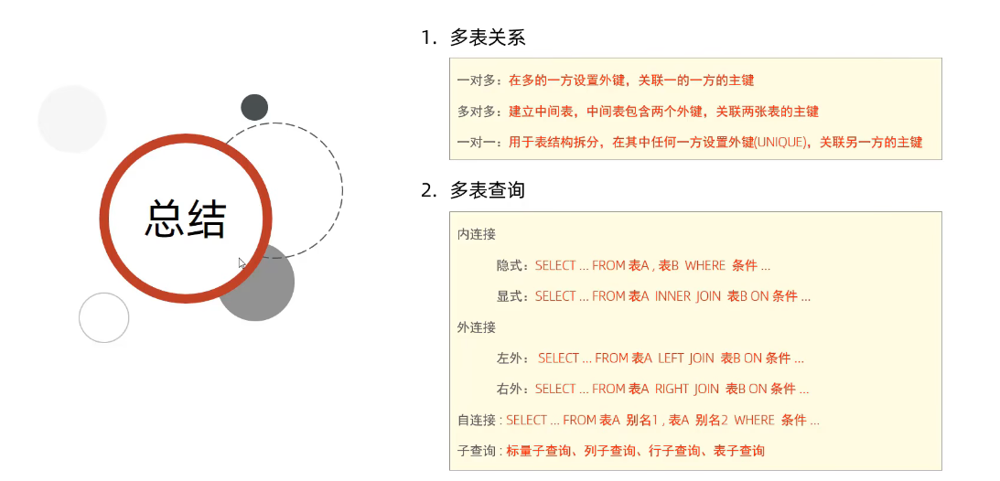

# Basic Part

## MySQL 概述

### 数据库相关概念

数据库：$DataBase$
数据库管理系统：$DBMS$

关于$SQL$
操作关系型数据库的编程语言
$Structured$ $Query$ $Language$

Learn about $MySQL$

表

#### 数据模型

关系型数据库：在关系模型基础上，使用多张相互连接的二维表连接而成。

## SQL

关于SQL通用语法、SQL分类、DDL、DML、DQL、DCL等

### SQL通用语法

分号结尾，具体后面搞
注意：**SQL 语句不区分大小写**

### SQL分类



$Definition$，$Manipulation$，$Query$，$Control$

### $DDL$

$Data$ $Definition$ $Language$

查询：
查询所有数据库：

```SQL
SHOW DATABSES
```

查询当前数据库：

```SQL
SELECT DATABASE();
```

创建：

```SQL
CREATE DATABASE [IF NOT EXISTS] 数据库名 [DEFAULT CHARSET 字符集] [COLLATE 排序规则];
```

删除：

```SQL
DROP DATABASE [IF EXISTS]数据库名;
```

使用：

```SQL
USE 数据库名;
```

#### DDL-表操作-查询

查询当前数据库所有表：

```SQL
SHOW TABLES;
```

查询表结构：

```SQL
DESC 表名字;
```

查询指定表的建表语句：

```SQL
SHOW CREATE TABLE 表名;
```

#### DDL-表操作-创建

```SQL
CREATE TABLE 表名(
    字段1 字段1类型[COMMENT 字段1注释]
)[COMMENT 表注释];
```

#### DDL-数据类型

比如说

```SQL
score double(4, 1)
```

表示长度为4，小数后位数为1

日期类型：DATE，TIME，YEAR，DATETIME

一个例子：

```sql
create table exp(
    id int,
    worknumber varchar(10),
    name varchar(10) comment 'name',
    gender char(1) comment '性别',
    age tinyint unsigned comment '年龄',
    idcard char(18) comment '身份证号',
    entrydate date comment '入职时间'
) comment 'information for worker';

```

一般定长的char，变长的varchar

#### DDL-表操作-修改

添加字段

```sql
ALTER TABLE 表名 ADD 字段名 类型（长度）[comment ...]

```

修改数据类型：

```sql
alter table 表名 modify 字段名 新数据类型（长度）;
```

修改字段名和字段类型：

```sql
alter table 表名 change 旧字段名 新字段名 类型（长度）[comment 注释][约束];
```

删除字段

```sql
alter table 表名 drop 字段名;
```

修改表名

```sql
alter table 表名 rename to 新表名;
```

删除表

```sql
drop table [if exists] 表名;
```

删除指定表，并且重新创建该表

```sql
truncate table 表名;
```

### $DML$

用来对数据库中表的数据记录进行增删改操作

添加：$Insert$
修改：$Update$
删除：$Delete$

#### $DML$-添加数据

给指定字段添加数据：

```sql
Insert Into 表名（字段名1，字段名2）Values（值1，值2，……）;
```

给全部字段添加数据：

```sql
Insert Into 表名 Values （值1， 值2， ……）;
```

批量添加数据：

```sql
// 这个其实就是后面多加几个数据串
```

#### $DML$-修改数据

```sql
update 表名 set 字段名1 = 值1，字段名2 = 值2， ……[WHERE 条件];
```

#### $DML$-删除数据

```sql
Delete From 表名 [Where 条件]
```

如果不加$where$条件，就会把所有的东西都删掉。

### $DQL$

$DQL$是$Data$ $Query$ $Language$

这是被**广泛使用**的一类语句

```sql
Select
    字段列表
From
    表名列表
Where
    条件列表
Group By
    分组字段列表
Having
    分组后条件列表
Order By
    排序字段列表
Limit
    分页参数
```

#### $DQL$-基本查询

查询多个字段：

```sql
Select 字段1，字段2，字段3…… From 表名;
Select * From 表名; // All 字段
```

设置别名：

```sql
Select 字段1 As 别名1，字段2 As 别名2 From 表名;
```

去除重复记录：

```sql
Select Distinct 字段列表 From 表名;
```

#### $DQL$-条件查询

语法：

```sql
Select 字段列表 From 表名 Where 条件列表;
```

特别注意：**$MySQL$语句中使用三值查询：TRUE, FALSE, UNKNOWN**

注意那个模糊匹配的语法格式，比如下面这个例子：

```sql
select * from emp where name like '___';
```

$m$个下划线说明了字长是$m$

```sql
select * from emp where idcard like '%1';
```

$\%$说明前面多少位都无所谓，最后一个得是1

#### $DQL$-聚合函数

将一列数据作为一个整体，进行纵向计算。

常见聚合函数：$max$, $min$, $avg$, $sum$, $count$.

```sql
select 函数名 from 表名;
```

$null$值**不参与**聚合函数计算

#### $DQL$-分组查询

```sql
select 字段列表 From 表名 [Where 条件] Group By 分组字段名 [Having 分组后过滤条件];
```

##### $where$和$Having$区别

1. 执行时机不同：Where是分组前进行过了，不满足Where条件，不参与分组；而Having是分组之后对结果进行过滤；
2. 判断条件不同：Where不能对聚合函数进行判断，而Having可以。

注意：

a. 执行顺序：where > 聚合函数 > having
b. 分组之后，查询的字段一般为聚合函数和分组字段，查询其他字段没有意义。

#### $DQL$-排序查询

$ORDER$ $BY$

```sql
select 字段列表 from 表名 order by 字段1 排序方式1，字段2, 排序方式2;
```

排序方式：
ASC：升序
DESC：降序

#### $DQL$-分页查询

$LIMIT$

这个就是弄出来那种一页一页的滚动页面

```sql
select 字段列表 from 表名 limit 起始索引, 查询记录数;
```

注意点：

1. 起始索引从0开始，$$起始索引 = (查询页码 - 1) \times 每页显示记录数$$
2. 分页查询是数据库的**方言**，不同数据库实现方式不同，在$MySQL$中是$LIMIT$
3. 如果查询的是第一页数据，起始索引可以忽略，直接简写为$LIMIT$ $10$

#### $DQL$-执行顺序

注意区分**编写**顺序和**执行**顺序！
执行次序：from->where->group by->having->select->order by->limit



### $DCL$

即**数据控制语言**：$Data$ $Control$ $Language$
管理数据库用户、控制数据库的访问权限。

#### $DCL$-管理用户

查询用户：

```sql
USE mysql; # 这个mysql是系统数据库
Select * From user;
```

创建用户：

```sql
create user  '用户名'@'主机名' IDENTIFIED BY '密码';
```

修改用户密码：

```sql
alter user '用户名'@'主机名' IDENTIFIED WITH mysql_native_password BY '新密码';
```

删除用户：

```sql
DROP USER '用户名'@'主机名';
```

**主机名可以用$\%$通配**

#### $DCL$-权限控制

查询权限：

```sql
show grants for '用户名'@'主机名';
```

授予权限：

```sql
GRANT 权限列表 ON 数据库名.表名 TO '用户名'@'主机名';
```

撤销权限：

```sql
REVOKE 权限列表 ON 数据库名.表名 FROM '用户名'@'主机名';
```

## Function/函数

### 字符串函数

内置的

```sql
Concat(s1, s2, s3, ……, sn) # 字符串拼接
Lower(str) # 全部转为小写
Upper(str) # 全部转为大写
LPAD(str, n, pad) # 左填充
RPAD(str, n, pad) # 右填充
TRIM(str) # 去掉字符串头部和尾部的空格
SubString(str, start, len) # 返回从字符串str从start位置起的len个长度的字符串
```

### 数值函数

```sql
ceil(x) # 向上取整
floor(x) # 向下取整
mod(x, y) # return x % y
rand() # return rand(0, 1)
round(x, y) # return x.len(y)
```

### 日期函数

```sql
curdate() # return cur date
curtime() # return cur time
now() # return cur date, time
year(date) # ...
month(date) # ...
select date_add(now(), INTERVAL 70 YEAR);
```

### 流程函数

实现条件筛选，提高语句效率

```sql
IF(value, t, f); 
ifnull(value1, value2)
case when [value1] then [res1] else [default] end
case [expr] when [val1] then [res1] else [default] end
```

## 约束

### 概述

非空约束：$NOT$ $NULL$
唯一约束：$UNIQUE$
主键约束：$PRIMARY$ $KEY$
默认约束：$DEFAULT$
检查约束：$CHECK$
外键约束：$FOREIGN$ $KEY$

### 外键约束

在数据库层面，没有外键的关联，是无法保证数据的一致性和完整性的。

#### 语法

语法：

添加外键

```sql
Create Table 表名(
    字段名 数据类型
    [Constraint][外键名称] Foreign KEY(外键字段名) References 主表(主表列名)
);

Alter Table 表名 Add Constraint 外键名称 Foreign Key(外键字段名) References 主表(主表列名);
```

删除/更新行为

Cascade：当在父表中删除/更新对应记录时，首先检查该记录是否有对应外键，如果有，则也删除/更新外键在子表中的记录。

```sql
Alter Table 表名 Add Constraint 外键名称 Foreign Key (外键字段) References 主表名(主表字段名) On Update Cascade on delete Cascade;
```

这部分内容有点混乱


## 多表查询

### 多表关系

表结构之间的联系：一对多（多对一）、多对多、一对一

### 多表查询概述

笛卡尔积：集合A, B的所有组合情况

在多表查询时，需要消除无效的笛卡尔积

### 内连接

内连接查询的是**两张表交集**的部分

隐式内连接：

```sql
Select 字段列表 From 表1，表2 Where 条件……;
```

显示内连接：

```sql
Select 字段列表 From 表1 [Inner] Join 表2 On 连接条件……;
```

### 外连接

左外连接

```sql
Select 字段列表 From 表1 LEFT [Outer] Join 表2 On 条件……;
```

### 自连接

语法结构

```sql
Select 字段列表 From 表A 别名A Join 表A 别名B On 条件……;
```

自连接查询，可以是内连接查询，也可以是外连接查询。

### 联合查询

$union$, $union$ $all$

```sql
Select 字段列表 From 表A……
Union [All]
Select 字段列表 From 表B……
```

对于 Union All，把全部数据合并到一块，而Union会对合并之后的数据进行去重。
**还有，注意字段列表要一致。**

### 子查询

SQL语句中嵌套SELECT语句，称为**嵌套查询**，又称**子查询**。

```sql
Select * From t1 where column1 = (select column1 from t2);
```

子查询外部语句可以是Insert/Update/Delete/Select中的任何一个。

#### 标量子查询

例如

```sql
select * from emp where entrydate > (select emp.entrydate from emp where name = '金庸');
```

#### 列子查询

子查询返回结果为一列

```sql
IN
NOT IN
ANY # 子查询返回列表中，有一个满足即可
SOME # 等价于 ANY
ALL
```

#### 行子查询

由于行子查询返回的结果是一行多列

例如：

```sql
select * from emp where (salary, managerid) = (select salary, managerid from emp where name = '张无忌');
```

#### 表子查询

子查询返回结果是多行多列，这种子查询称为**表子查询**
操作符：$IN$

### 多表查询小结


