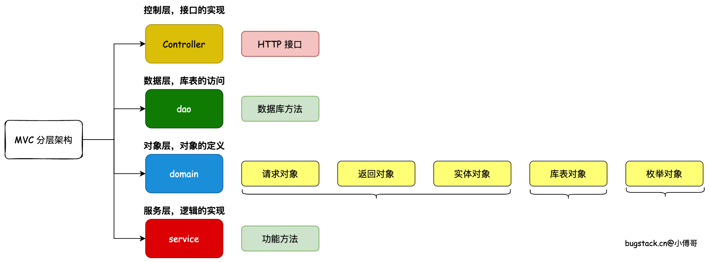
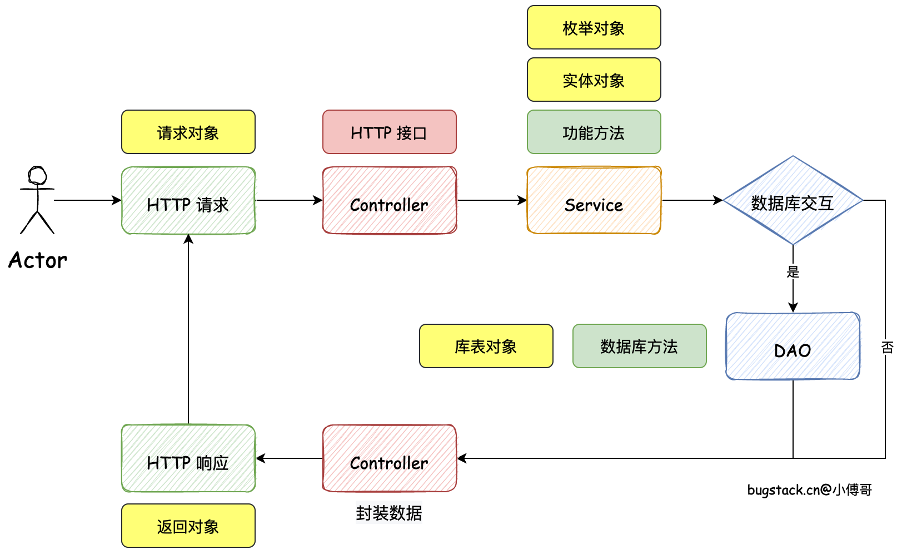

# Overview of System Architecture Design

此部分为我对于**系统架构设计**的初步学习

## MVC 架构设计

关于MVC的架构设计，刚刚阅读了小傅哥的这篇文章，讲的挺不错的，主要是他图画的非常清晰：[MVC架构设计](https://bugstack.cn/md/road-map/mvc.html)

看完这篇文章，突然想起来之前做的基础项目：苍穹外卖的时候，其架构设计即是如此，如今终于有个明确的理解，或者说是纵览全局的视野了。

### MVC分层架构图



### MVC的全称到底是什么东西？

要理解一个名词究竟是什么含义，特别是这种英文缩写，最好的办法是直接去查一下，不拖。

#### MVC 全称

MVC 的全称是 **Model-View-Controller**，即 **模型-视图-控制器**。

---

#### 三层含义

| 层级  | 全称                   | 职责                               |
| ----- | ---------------------- | ---------------------------------- |
| **M** | Model（模型层）        | 负责数据处理、业务逻辑、数据库交互 |
| **V** | View（视图层）         | 负责数据展示、用户界面呈现         |
| **C** | Controller（控制器层） | 负责接收请求、协调 Model 和 View   |

---

#### 工作流程

```java
用户请求
    ↓
Controller（接收并处理请求）
    ↓
Model（处理业务逻辑 / 操作数据库）
    ↓
Controller（获取数据）
    ↓
View（渲染并返回结果给用户）
```

---

#### 在 Java 项目中的典型对应

- **Model** → `Service层` + `DAO/Repository层` + `实体类(Entity/POJO)`
- **View** → `JSP` / `Thymeleaf` / `前端页面`
- **Controller** → `@Controller` / `@RestController` 注解的类

---

> MVC 的核心思想是**关注点分离**，使代码结构清晰、易于维护和扩展，是 Java Web 开发中最经典的架构模式之一。

## MVC 的调用流程


